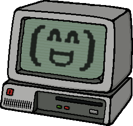

<h2 align="center">Heya ! I'm Herwin Bozet </h2>
<h4 align="center">
  <b><a href="https://nibblepoker.lu/">Website</a></b>
  <!--•
  <s>Blog</s>-->
  •
  <a href="https://www.linkedin.com/in/herwin-bozet/">LinkedIn</a>
  •
  <a href="https://twitter.com/NibblePoker">Twitter</a>
</h4>

I specialize in minimalistic CLI tools, libraries, self-hosting, electronics and SBCs.

🧰 I develop in <b>PureBasic</b>, <b>Python</b>, C99, C#, JS, PHP, <b>VBA</b>, Java, ...</b> 
🏅 Made people's day with [Excel Password Remover](https://github.com/aziascreations/Excel-Worksheet-Password-Remover) & [Youtube Auto Archiver](https://github.com/aziascreations/Youtube-Auto-Archiver) 
🌍 Open to contribute to FOSS in my spare time 
✉️ You can hit me up by <b><a href="mailto:herwin.bozet@gmail.com">Email</a></b>, <a href="https://twitter.com/NibblePoker">Twitter</a>, <a href="https://discord.com/channels/@me/220400807558774785/">Discord</a> or <a href="https://libera.chat/">Libera.Chat (/msg NibblePoker) 

Check out the [NibblePoker](https://github.com/NibblePoker) organization on GitHub for more "professional" projects.
